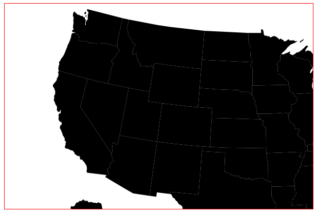
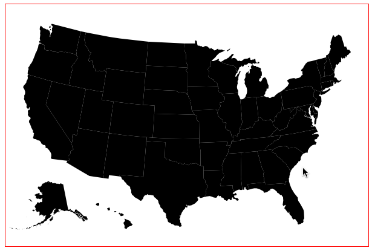
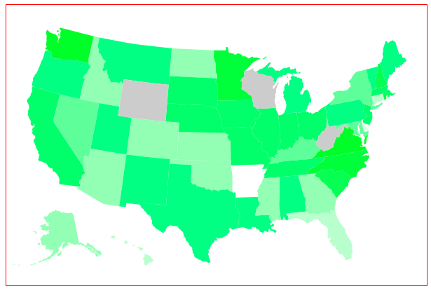
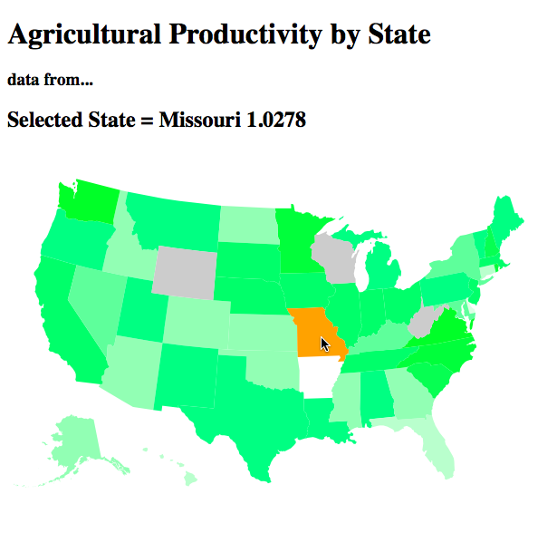

### D3: Hands On

In this Hands On you will build an interactive map of the US using D3. I have
adapted this tutorial from the
[Interactive Data Visualization for the Web](http://alignedleft.com/work/d3-book)
by Scott Murray, which is the best book on D3 I have found. It goes into far
more depth than we could possibly have time for here. I highly recommend reading
it.


## HTML Setup

Using D3 is pretty easy. Just load the Javascript from their website. Some
people have reported encoding issues, so be sure to set the charset of
your page to utf-8.  Below is a good start. Copy and paste it into
a file called `states.html`;


```
<!DOCTYPE html>
<head>
    <meta charset="utf-8">
    <script src="http://d3js.org/d3.v3.min.js" charset="utf-8"></script>
    <style>
        svg {
            border: 1px solid red;
            width: 600px;
            height: 400px;
        }
    </style>
</head>
<body>
<script type='text/javascript'>
var w = 600;
var h = 400;

//setup our display area
var svg = d3.select('body')
            .append('svg')
            .attr('w',w+'px')
            .attr('h',h+'px');
</script>
</body>
</html>
```

Note the css for the `svg` element. This gives it a fixed size and puts a red
border around it. I like to use red borders during development because it helps
me to see things that might be invisible otherwise.

## Loading Maps

Now you need a map. D3 has built in support for a mapping standard called
[GeoJSON](http://geojson.org). GeoJSON is a simple format for geographic data
structures.  Scott put a geojson map of the United States in the gitrepo for his
book. You can download `us-states.json` from
[here](https://github.com/alignedleft/d3-book/tree/master/chapter_12). Put the
file in the same directory as your html page.


GeoJSON contains locations and path data. Path data is the actual shape of the
geographic object, in this case the individual states of America. Unfortunately
GeoJSON path data is in a different format than SVG paths. Furthermore they are
both complex and nasty formats, difficult work with by hand. Fortunately D3 comes with with
a `path` object to convert between them. Create one like this:

```
//make an path object to convert from geojson paths to svg paths
var path = d3.geo.path();
```

Now we can actually load some data. D3 loads GeoJSON files asynchronously with the
`json` function. It takes the filename / url of the json file, then a callback
function to be run when the file is done loading.  That is where you can draw
the path data.  Add this code next:


```
//load the data
d3.json('us-states.json', function(json) {
    //when the json file is loaded
    // set up the paths for each state
    svg.selectAll('path')
        .data(json.features)
        .enter()
        .append("path")
        .attr('d',path) //bind the converter
        ;
});
```

Reload your page and you should see a map of the US. The states are all
black because we haven't assigned any colors yet.

.screenshot

## Map Projections

Chances are the map doesn't look right. While the states may be shaped correctly
the map is too big to fit inside the SVG block, and isn't centered. We can fix
these with a _projection_. A
[projection](http://en.wikipedia.org/wiki/Map_projection) is a mapping term
referring to how real world three dimensional geographical data is drawn onto a
two dimensional surface. D3 supports many different projections. For this
project we will use the
[Albers equal-area conic projection](http://en.wikipedia.org/wiki/Albers_projection),
which is one of the most common projections used for North America.  Change
the path code from this:

```
//make an path object to convert from geojson paths to svg paths
var path = d3.geo.path();
```

to this:

```
//setup a projection
var projection = d3.geo.albersUsa()
    .translate([w/2,h/2])
    .scale(750) //1000 is the default scale
    ;

var path = d3.geo.path().projection(projection);
```

The projection translates the map to be centered in the SVG box. It also scales
the map down slightly so it will fit. Be sure to apply the projection to the
path object so that D3 will use it when drawing the map.

.screenshot


## Loading Data

Now we have a map, but the colors don't actually represent anything. The magic
of D3 is that we can visualize data, so lets go get some data. Again from
Scott's [github repo](https://github.com/alignedleft/d3-book/tree/master/chapter_12),
download the `us-ag-productivity-2004.csv` file. This is a
comma delimited table of agricultural productivity data for each US state in
2004.

Again we load the data with a callback, `csv` this time. Make sure this
code goes *inside* the `d3.json` callback. That way the csv code will
be called after the geojson is already loaded.

```
    d3.csv('us-ag-productivity-2004.csv', function(data) {
    });
```

Before we use the data we need to massage it a bit. One of the limitations of D3
is that it only binds to one set of data at a time. We need to attach the
productivity data to the geojson data by matching up each data point state by
state.  Create a new function called `matchByState` which loops through the
data. It looks like this:

```
// smoosh function
function matchByState(json,data) {
    // smoosh ag productivity data with the geojson data
    for(var i=0; i<data.length; i++) {
        var dataState = data[i].state;
        for(var j=0; j<json.features.length; j++) {
            var jsonState = json.features[j].properties.name;
            if(dataState == jsonState) {
                json.features[i].properties.value = parseFloat(data[i].value);
                break;
            }
        }
    }
}
```

The code above looks complex but it's actually pretty simple. It loops through
the productivity data. For each state it finds the matching state in the
geojson, then assigns the value. Once `matchByState` is done the `json` object
will contain both the map shapes and the productivity data.

Now call `matchByState` from within the csv callback function.

```
d3.csv('us-ag-productivity-2004.csv', function(data) {
    matchByState(json,data);
```

## Coloring Data

We are almost ready to show the data. For each state
we can look up the agriculture value and set the fill
color of the shape to...? Hmm. How should we convert data
values into colors that look good?

In the bar chart we converted numeric data values into
x and y positions using a _Scale_. We can do the same
thing to convert numeric data values into colors too.
Let's start by making a bunch of colors.

```
var colors = [];
// some output colors
for(var i=1; i<=10; i++) {
    var v = Math.round(i*255.0/10);
    colors.push('rgb('+v+',255,'+v+')');
}
```


This code will create a list of green colors going from black to pure green. Now
create a new _quantize_ scale using the list of colors as the range ( _outputs_ )
and set the domain ( _inputs_ ) from the min and max of the data. Since you
will access the data over and over, create a `getValue` function to pull
it out.


```
var color = d3.scale.quantize().range(colors);

//function to get productivity value
function getValue(d) {
    return parseFloat(d.value);
}

//set up the domain / input of our color scale
color.domain([
    d3.min(data, getValue),
    d3.max(data, getValue)
    ]);
```


Now the color can be calculated from the input value. Create a reusable
function called `calcColor` since we will need to do this in several places.


```
//function to calculate a color based on the productivity value
function calcColor(d) {
    var value = d.properties.value;
    if(value) return color(value);  // get color from the color Scale
    return '#ccc'; //gray if there is no value
}
```

Okay. Now with *all* of that stuff in place, you can add a fill step to the
`svg.selectAll` function chain. The only new line is the last one to set the
fill with `calcColor`. Note that all of this takes place _inside_ of the
`d3.csv()` callback which is inside of the `d3.json()` callback. You may need to
move your code down a bit.

```
// set up the paths for each state
svg.selectAll('path')
    .data(json.features)
    .enter()
    .append("path")
    .attr('d',path) //bind the converter
    .attr('fill', calcColor)
    ;
```

Now reload your page and it should look like this:

.screenshot


Now *that's* a pretty cool looking map. There's just one more thing. It's not
actually interactive yet. It would be nice to have a hover effect when
you move your mouse over each state. This part is easy because we already
have everything else in place. Add another `svg.selectAll` function chain with
mouse event handlers. Put it right after the existing `svg.selectAll` call.

```
svg.selectAll('path')
    .on('mouseover', function() {
        d3.select(this)
            .transition().duration(250)
            .attr('fill','orange');
    })
    .on('mouseout', function() {
        d3.select(this)
            .transition().duration(250)
            .attr('fill',calcColor);
    })
```

This code sets the fill to orange when the mouse moves over a state, then sets
the fill back to the original color on mouse-out using the `calcColor` function
again. Notice the `.transition().duration(250)` lines. These make the colors
change smoothly over a quarter of a second (250 milliseconds) rather than an
abrupt swap.

There's just one more thing to add. When the user actually clicks on a state
we should show the actual state name and productivity value at the top. At the
top of your HTML (just above the `script` element) add these lines.

```
<h1>Agricultural Productivity by State</h1>
<h3>data from...</h3>
<h2>Selected State =
    <b id='statename'>name</b>
    <b id='agvalue'>value</b>
</h2>
```

Then add another event handler to set the `statename` and `agvalue` when
the user clicks on the state.


```
//add event handlers
svg.selectAll('path')
    ... other event handlers here
    .on('click',function(d) {
        d3.select("#statename").text(d.properties.name);
        d3.select("#agvalue").text(d.properties.value);
    })
    ;
```

And now it looks like this:

.screenshot


As an exercise to the reader, we can give each state a nice black border
with just a single line of code. Can you figure out how?

That's it! You just built a pretty sweet interactive map of the entire United
States that will run in almost any webbrowser. From here you could use different
colors, plug in different data, or combine it with other Javascript libraries.

In the next chapter, let's see how to get more data and more interactivity.
